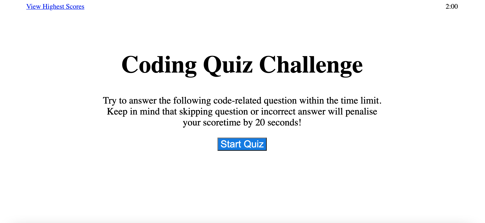
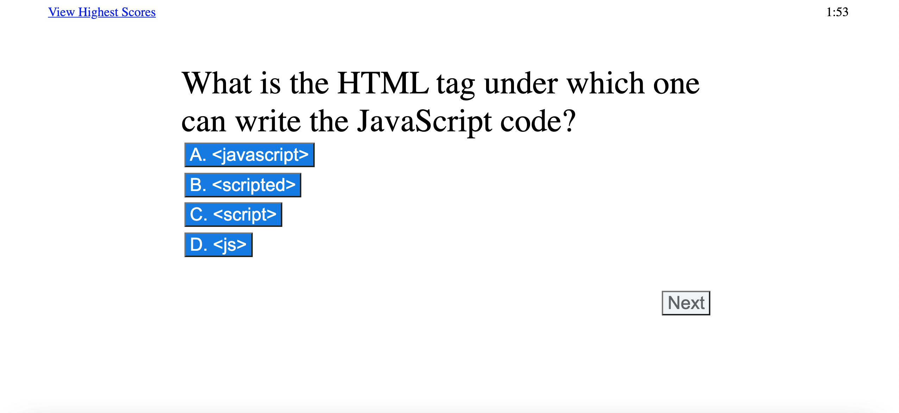
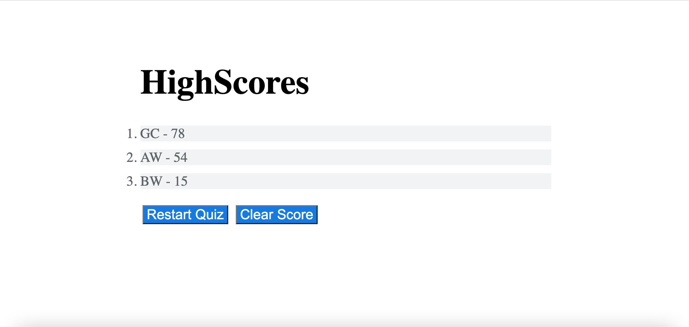

# Timed Quiz

## Javascirpt Quiz.
As you proceed in your career as a web developer, you will probably be asked to complete a coding assessment. These assessments are typically a combination of multiple-choice questions and interactive challenges. 

## Instructions
From scratch, a timer-based quiz application that stores high scores is built. The score will be determined by how less time you have spent on completing this quiz.

Here are some guidelines:

On homepage, user can access the navigation to "View HighScores" and the "Timer" value set at 2 mins. Quiz will start once user click "Start Quiz".

Clicking the "Start Quiz" button wil present the user a series of questions. The timer wil begin to countdown.

Score is calcuated by time remaining. Answering quickly and correctly results in a higher score. Answering incorrectly or skipping question result in a time penalty (20 seconds)

When time runs out or all questions are answered, the user will be presented with their final score and asked to enter their initials. Their final score and initials are then stored in localStorage.

This application is responsive, ensuring that it adapts to multiple screen sizes.

## Screenshots
Home Page:

Quiz Page:

HighScore Page

